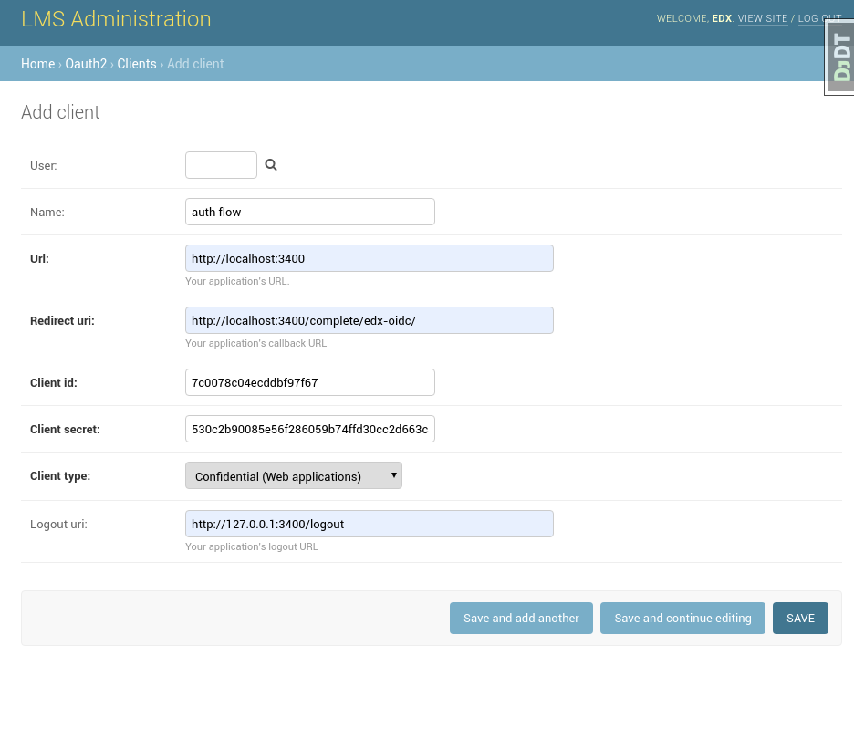
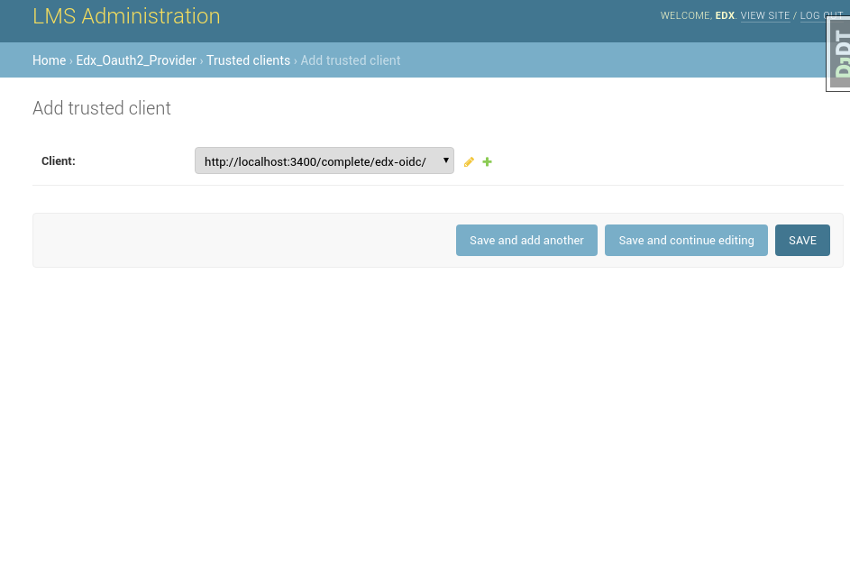

## setting app Oauth client

###Step 1
add your app to client list in  edx: 

 
 **we are going to use 'client id' and 'client secret' in our app**

  - go to app.js  and change to macth your configuration: 
  	- OIDC_CLIENT_ID = "7c0078c04ecddbf97f67";
	- OIDC_CLIENT_SECRET = "530c2b90085e56f286059b74ffd30cc2d663c8a6";
	- OIDC_REDIRECT_URI = "http://localhost:3400/complete/edx-oidc/"; 

Note: set clinet type as confidential for more explanation  check the video in openid.md

###Step 2
add your app to  trusted client list in  edx: 

edx will genrate token for you app if it is in trusted clinet (TODO in depth explanation)

###Step 3
add your app to  trusted client list in  edx: 

edx will genrate token for you app if it is in trusted clinet (TODO in depth explanation)

